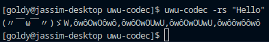
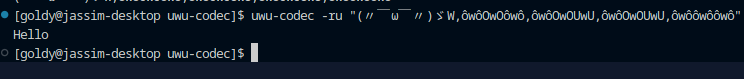

<div align="center">

  # 😳 uwu-codec (.uwu/.owo)

  <sub>Imagine one SINGLE file extension FOR EVERY PIECE OF MEDIA but ENCODED IN UWU BYTES!!!!!!</sub>

  [](https://youtu.be/f-Whvbco14I)

  ^ Cick to watch my youtube video on this! ^

</div>

> [!Note]
> Still a Work in progress, expect many many bugs. (feel free to contribute and report bugs)

> [!Warning]
> This iteration of uwu-codec currently **only supports** opening PNG images.
> I changed **ALOT** of the codebase after recording the first youtube video, so you cannot open videos atm despite the video; you have to convert them to an uwu file then convert it back if you would like to play a video.

## Usage 🖱️
```sh
uwu-codec [options] {target_file}
```
> Here's an example on opening an uwu/owo file:
> ```sh
> uwu-codec cat.owo
> ```

> This is how you may convert your files into an uwu/owo file:
> ```sh
> uwu-codec -c cat.png cat.uwu
> ```

> Want to convert just strings of text? Here's how:
> ```sh
> uwu-codec -rs "Hello"
> ```
> 
>
> Then you can convert it back to a string like so:
> ```sh
> uwu-codec -ru "(〃￣ω￣〃)ゞW,ôwôOwOôwô,ôwôOwOUwU,ôwôOwOUwU,ôwôôwôôwô"
> ```
> 

Check out the help command for more: ``uwu-codec --help``

### The codec also supports double-clicking on files!

[[Preview Video]](https://github.com/THEGOLDENPRO/uwu-codec/assets/66202304/1fb31651-448a-403e-a4a6-1ffb8f6b2e0a)

To set it up, just set .uwu or .owo files on your desktop environment or XDG to open with the uwu-codec binary located in ``.cargo/bin`` on Windows and at ``/usr/bin/`` on Linux.


## Installation 🛠️
I don't plan on releasing to any package managers yet, so for now you have one option, install from source (like a real man).

> [!Warning]
> On Linux if the ``uwu-codec`` command doesn't work you may need to add the ``~/.cargo/bin`` directory to your path if you . You can do so by adding ``export PATH=$PATH:~/.cargo/bin`` to your ``.bashrc`` or an equivalent.

### Install from source 🏗️
Prerequisites: **[``git``](https://git-scm.com/downloads), [``rust-lang``](https://www.rust-lang.org/tools/install), ``make`` (recommended)**

```sh
git clone https://github.com/THEGOLDENPRO/uwu-codec
cd uwu-codec
```

Now if you have 'make' you may just run these commands and you're done:
```sh
make # build

# Linux
sudo make install # install to bin

# Windows
make install # on windows it will install to '.cargo\bin\'.
```
> If you don't have 'make' for some reason go and copy the code from the [makefile](https://github.com/THEGOLDENPRO/aghpb-cli/blob/master/Makefile) yourself.